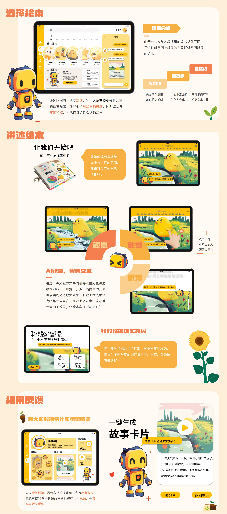
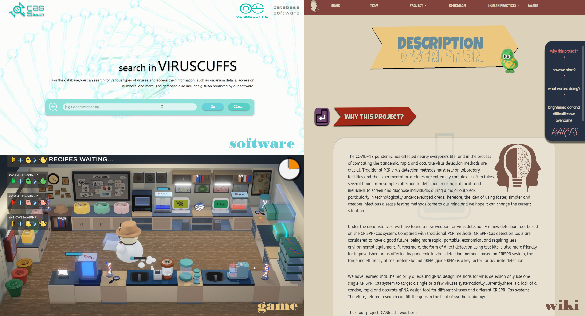








# 👋 Welcome!

My name is **Weida Wang (zh: 王蔚达)**, and I also go by David. I am a fourth-year undergraduate student at the [School of Computer Science and Technology, Tongji University](https://sse.tongji.edu.cn/) majoring in Software Engineering. As a developer and researcher, my primary interests lie in **graph-based machine learning**, **LLM reasoning** and **AI for science (AI4Science)**. 

Over the past few years, I have gained substantial research experience across various domains. I have worked as a research assistant in the [Graph Signal Processing Lab](https://sse.tongji.edu.cn/xygk/xygk.htm) at Tongji University, collaborating with AP. [Jin Zeng](https://scholar.google.com/citations?hl=en&user=jBxf3FYAAAAJ). My journey also includes research stints at the [Intelligent Internet of Things Research Center (IIOT)](https://iiot.sjtu.edu.cn/#/)  at Shanghai Jiao Tong University, under the mentorship of Prof. [Guanjie Zheng](https://scholar.google.com.hk/citations?hl=zh-CN&user=jJpqDQIAAAAJ). 

If you'd like to connect or discuss potential collaborations, don't hesitate to drop me an [email](tjudavidwang@gmail.com).

<!-- My research interest includes ai4science and graph-based machine learning. I have published several papers at the top international geotech conferences/journal with total . -->

# 🔥 News
- *2024.09*: 📣📣 Excited to join the [OpenScienceLab](https://science.openxlab.org.cn/) at the [Shanghai AI Laboratory](https://www.shlab.org.cn/) as a Ph.D. student in AI4Science.
- *2022.09*: 🎉🎉 Selected as a member of the [Outstanding Science and Innovation Talent - Youth Enlightenment Program](https://mp.weixin.qq.com/s/bFF-IJLT49Ftm5x48avsCw) at Tongji University.

# 📝 Publications 

- **Characteristics of physical parameters and predictive modeling of mechanical properties in loess-like silty clay for engineering geology** 
  *Xianfeng Ma, Zhenghao Liu, <u><b>Weida Wang</b></u>, Junjie Wang, Linhai Lu, Dingyi Zhou, Hanwen Zhang* 
  Engineering Geology (JCR Q1, IF=6.9) 
  <a href="https://www.sciencedirect.com/science/article/abs/pii/S0013795224002722">Page</a>

- **DNN–GA–RF prediction model for rock strength indicators based on sound level and drilling parameters** 
  *Zhenghao Liu, <u><b>Weida Wang</b></u>, Yuning Chen, Shaoshuai Shi, Junjie Wang, Ruijie Zhao* 
  Bulletin of Engineering Geology and the Environment  (JCR Q1, IF=3.7) 
  <a href="https://link.springer.com/article/10.1007/s10064-024-03854-z">Page</a>
- One paper has been submitted to KDD 2025 Research Track August as the second author, hope it be accepted🙏!

# 🏅 Honors and Awards
- *2023* National Scholarship (top 0.2% nation-wide)
- *2022,2023* Merit Student in Tongji University 
- *2023* 🥇 Gold Medal of International Genetically Engineered Machine Competition (iGEM) AI & Software Track
- *2023* 🥇 First Prize of National Undergraduate Mathematics Competition (Non-mathematics Category) 
- *2023* 🥇 First Prize of China Undergraduate Computer Design Competition (top 0.1% nation-wide)
- *2023* 🥈 Second Prize of China Collegiate Computing Contest HCI Innovation Competition (top 0.4% nation-wide)
- *2023* 🥇 First Prize of HuaShu Cup National Undergraduate Mathematical Modeling Contest  (top 2% nation-wide)
- *2023* 🥈 Honorable Mention of Mathematical Contest in Modeling 
- *2022* 🥇 First Prize of Undergraduate Mathematics Competition (Non-mathematics Category) in Shanghai

# 📖 Educations
- *2020-2025 (expected)*, Software Engineering, Tongji University, Shanghai, China
  - Supervised by [AP. Jin Zeng](https://scholar.google.com/citations?hl=en&user=jBxf3FYAAAAJ) and [Prof. Lin Zhang](https://scholar.google.com/citations?hl=en&user=8VOk_S4AAAAJ)

# 💻 Internships
- *2023.07 - Present*, Graph Signal Processing Lab, Tongji University
- *2023.11 - Present*, Intelligent Internet of Things Research Center (IIOT), Shanghai Jiao Tong University [[link]](https://iiot.sjtu.edu.cn/#/)
- *2023.11 - 2024.03*, City Science Lab@Shanghai (MIT Media Lab) [[link]](https://www.media.mit.edu/projects/city-science-lab-shanghai/overview/)
- *2023.03 - 2024.03*, Key Laboratory of Geotechnical and Underground Engineering of the Ministry of Education, Tongji University [[link]](https://geokeylab.tongji.edu.cn/)
- *2023.07 - 2023.08*, Hundsun Technologies Inc. [[link]](https://en.hundsun.com/)

# 🧩 Projects 

CCCC HCI 2023

**[ImagiTale - An Interactive Storybook Learning App for Children](https://www.bilibili.com/video/BV1FdHreAESo/?spm_id_from=333.999.0.0)**

**Weida Wang**, Leya Yang, Xin Li, Yao Zhang, Yutong Fu, Xinyi Liao

[**Mobile App**](https://www.appcontest.net/) | <strong>CCCC 2023&2024 Award-Winning Work</strong>

- ImagiTale is an AI-driven application designed for children aged 6-8 and their parents. It enhances children's language expression and cognitive development by providing personalized picture book recommendations and encouraging active storytelling. 
- The app is developed specifically for iPad using <u>Xcode</u> and <u>Swift</u>, with a user interface designed in <u>SwiftUI</u>. It employs <u>SAM</u> for dynamic image segmentation, enhancing visual interactivity. <u>ChatGPT</u> generates engaging dialogues, while <u>Swift Speech</u> handles speech-to-text and text-to-speech conversion. Additionally, a custom emotion analysis model offers tailored feedback to improve children's language learning through interactive storytelling.
- This project was submitted to the 2024 China Collegiate Computing Contest - Mobile Application Innovation Contest ([CCCC App](https://www.appcontest.net/)), where it advanced to the <u>finals (top 1%)</u> and won the <u>National Second Prize (top 0.4%)</u> and the <u>Best Innovation Award</u> in the 2023 China Collegiate Computing Contest HCL Innovation Competition ([CCCC HCI](http://hci.oppo.com/)).

iGEM 2023

**[CASleuth - the Virus Detective](https://2023.igem.wiki/tongji-software/)**

[Tongji-Software Team](https://teams.igem.org/4787): **Weida Wang***, Shiyi Zhou\*, Ziyang Zhang\*, Yao Zhang, Yuxuan Wang, Yutong Chen, Yuanyi Lu, Xialu Chen, Xuanyi Liu

[**Wiki**](https://2023.igem.wiki/tongji-software/) [**Software**](https://tongji-software-igem2023.com) [**Game**](https://www.bilibili.com/video/BV1Gh4y1v7Hv/?spm_id_from=333.999.0.0&vd_source=54848bbaacc95a6670b0f8ac0228b019) [**Video**](https://www.bilibili.com/video/BV1tz4y1M7aH/?spm_id_from=333.337.search-card.all.click&vd_source=54848bbaacc95a6670b0f8ac0228b019) | <strong>iGEM 2023 Software&AI Track Gold Medal Work</strong>

- The COVID-19 pandemic underscored the need for rapid and accurate virus detection methods, as traditional PCR-based approaches are often time-consuming and require complex laboratory environments. In response, our project focuses on a novel detection method using the CRISPR-Cas system, which offers a more rapid, portable, and cost-effective alternative, particularly suitable for underdeveloped areas. By targeting viral RNA sequences with guide RNAs (gRNAs) designed for specific Cas proteins, this method provides a promising future for scalable and accessible virus detection.
- To bridge the gap between cutting-edge biotechnology and public understanding, we designed an educational game called CASleuth. This game allows everyday users to learn about CRISPR-Cas technology interactively and engagingly. Alongside the game, we developed a software tool also named CASleuth, tailored for bioinformatics researchers. This tool facilitates efficient database queries and predictions of gRNA efficiencies for different viruses using a deep learning framework based on convolutional neural networks. The web platform serves to promote the project, raising awareness and encouraging adoption among both the scientific community and the general public.
- The CASleuth project was showcased at the 2024 iGEM competition, where it earned a [Gold Medal](https://jamboree.igem.org/2023/results#medals) for its innovative approach in combining education with bioinformatics, enhancing public engagement and advancing virus detection research.

